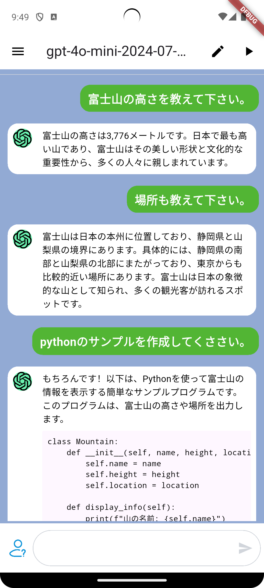

# Flutter ChatGPT Client

**LangChain + Flutter + Riverpod によるリアルタイム ChatGPT クライアント**

   

---

## 概要

Flutter × Riverpod × LangChain で構築した、LINE 風 UI のモダンな ChatGPT クライアントです。  
チャットは LangChain 経由で OpenAI のストリーミング API と連携し、AI 応答をリアルタイムで描画。Markdown レンダリングやアニメーション付きローディング、ハイブリッドなテキスト＆画像生成（`/image` コマンド）、フルスクリーン画像ビューア／ダウンロードなど、実務投入を想定した機能を備えています。  
UI は純 Flutter なので、モバイル／デスクトップ／Web へシームレスに展開できます。

---

## デモ動画


https://github.com/user-attachments/assets/3cea0cae-c619-4601-9172-82457ab98959


---

## ハイライト

- **リアルタイム・ストリーミング応答**  
  LangChain の `ChatOpenAI` でチャット履歴をストリーム処理。部分的なデルタが届くたびにバブルが更新され、Markdown と連動して自然なレンダリングを実現。
- **テキスト & 画像生成の両対応**  
  `.env` の `model` / `imageModel` を切り替えることで最新 GPT モデルへ柔軟に接続。`/image <prompt>` コマンドで画像生成 API を呼び出し、トーク内にサムネイルを埋め込み。
- **リッチな画像体験**  
  画像バブルをタップするとフルスクリーンプレビュー（ピンチズーム対応）が開き、その場でローカルへダウンロード可能。Base64/URL いずれのペイロードも自動判別。
- **洗練された UI/UX**  
  LINE 風のチャットバブル、アニメーションする「thinking...」インジケーター、Markdown を多用したドキュメント風レスポンス、SelectableText によるコピー体験を提供。
- **堅牢なアーキテクチャ**  
  Riverpod + ChangeNotifier で状態を管理し、LLM との通信は Repository 層へ集約。モジュールごとにテスト容易性と変更耐性を確保。
- **柔軟な環境設定**  
  `.env` で API キーやエンドポイントを完全に切り替え可能。OpenAI 互換プロキシや社内ゲートウェイを通した接続にも対応。

---

## アーキテクチャ概要

```
lib/
├── main.dart                     # エントリポイント + UI ルート
├── model/
│   ├── chat_message.dart         # 不変メッセージモデル (データ層)
│   └── chatmodel.dart            # ChangeNotifier (状態管理)
├── repository/
│   └── openai_repository.dart    # LangChain を使った LLM アクセス
└── widgets/                      # プレゼンテーション層
    ├── ai_message.dart
    ├── loading.dart
    ├── user_input.dart
    └── user_message.dart
```

- **Presentation**: Flutter Widgets (Material Design) + Markdown 表示  
- **State Management**: Riverpod ChangeNotifier を利用したメッセージストア  
- **Domain / Data**: LangChain による LLM 呼び出し、OpenAI 互換エンドポイント対応  
- **Testing**: `flutter_test` によるスモークテストを用意し、ProviderScope での依存解決を検証

---

## 技術スタック

| Layer            | Technology & Packages                                                                 |
| ---------------- | -------------------------------------------------------------------------------------- |
| UI/Presentation  | Flutter, Material Design, `flutter_markdown`, `flutter_svg`, `cached_network_image`    |
| State Management | Riverpod (`flutter_riverpod`)                                                          |
| LLM Integration  | LangChain (`langchain`), LangChain OpenAI (`langchain_openai`), `langchain_tiktoken`   |
| Networking       | `http`, OpenAI REST endpoints                                                          |
| Storage/IO       | `path_provider` (画像保存)                                                             |
| Config/Env       | `flutter_dotenv`                                                                       |
| Tooling          | Dart 3.3+, Flutter 3.19+, Very Good Analysis, Flutter Test                             |

---

## スクリーンショット & デモ



---

## セットアップ

1. **リポジトリを取得**
   ```bash
   git clone https://github.com/softjapan/flutter_chatgpt.git
   cd flutter_chatgpt
   ```

2. **依存関係の取得**
   ```bash
   flutter pub get
   ```

3. **環境変数の設定**  
   ルート直下に `.env` を作成し、以下を設定してください。
   ```env
   endpoint=https://api.openai.com/v1
   model=gpt-4o-mini-2024-07-18
   imageModel=gpt-image-1
   aiToken=your-openai-api-key
   ```

4. **アプリの起動**
   ```bash
   flutter run
   ```

---

## コマンドチートシート

| Purpose            | Command                        |
| ------------------ | ------------------------------ |
| 依存関係の更新     | `flutter pub get`              |
| LangChain の追加例 | `flutter pub add langchain`    |
| テスト実行         | `flutter test`                 |
| L10n/ビルド等      | `flutter build <platform>`     |

---

## 使い方のヒント

- 通常のメッセージはそのまま送信すれば GPT の応答が Markdown として表示されます。
- 画像を生成したい場合は `/image 空に浮かぶ近未来都市` のように `/image` もしくは `/img` プレフィックスを付けて送信してください。
- 生成された画像はタップで全画面表示 → 拡大縮小 → ダウンロードが可能です（モバイル／デスクトップアプリで動作）。
- `.env` の `endpoint` を差し替えれば OpenAI 互換 API（プロキシ、Azure OpenAI 等）にも接続できます。

---

## コントリビューション

1. リポジトリを **Fork**
2. ブランチを作成  
   ```bash
   git checkout -b feature/awesome-feature
   ```
3. 変更をコミット  
   ```bash
   git commit -m "Add awesome feature"
   ```
4. Push & Pull Request  
   ```bash
   git push origin feature/awesome-feature
   ```

---

## ライセンス

このプロジェクトは [MIT License](./LICENSE) の下で公開されています。

---

## Author

- **Twitter**: [システムエンジニア@JP](https://twitter.com/fullstack_se)  
- **GitHub**: [softjapan/flutter_chatgpt](https://github.com/softjapan/flutter_chatgpt)

---

### English Summary

A Flutter + Riverpod ChatGPT client leveraging LangChain’s `ChatOpenAI` for streaming responses, delivering a LINE-style chat experience with Markdown rendering, responsive UI, and environment-driven configuration. Cross-platform ready, production-oriented architecture with clear separation of concerns and automated testing.
